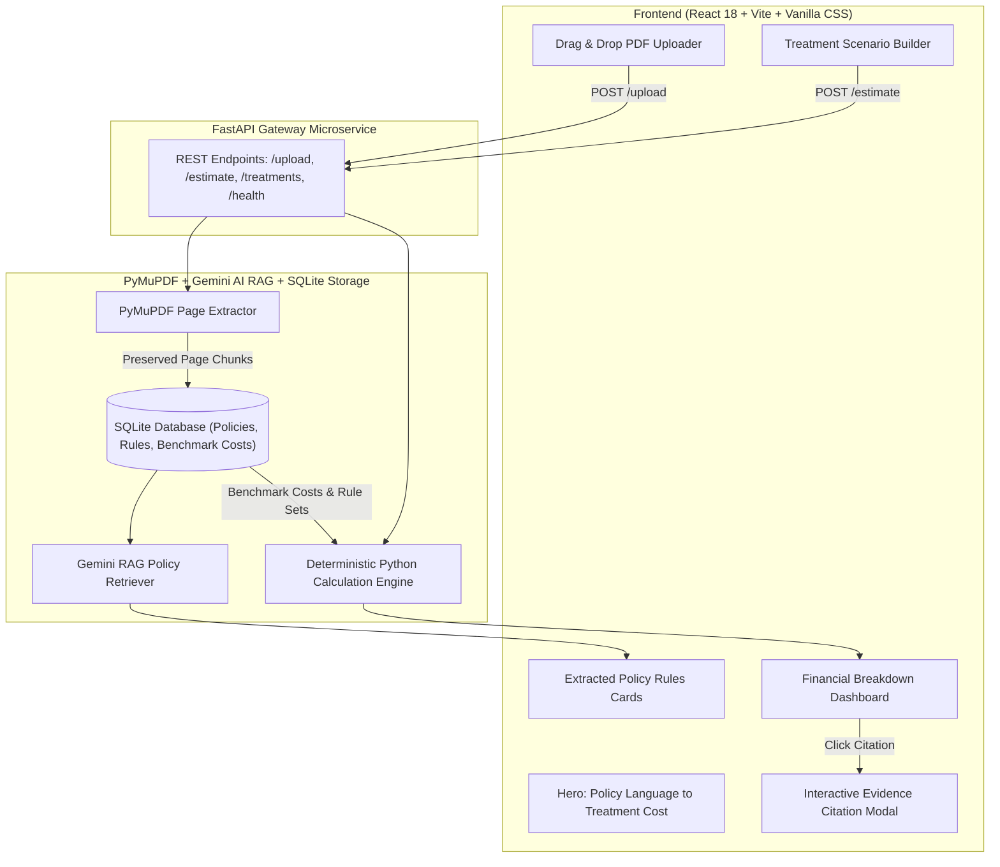

# Spasth — Health Insurance Policy Intelligence & Out-of-Pocket Cost Estimator

[](https://github.com/your-org/spasth)
[](https://fastapi.tiangolo.com/)
[](https://react.dev/)
[](https://ai.google.dev/)
[](https://pytest.org/)
[](LICENSE)

> **Bridge the gap between complex health insurance policy language and real-world out-of-pocket medical costs using LLM document extraction and deterministic financial calculation logic.**

---

## 💡 Problem Statement & Core Value Proposition

Insurance policies are notoriously opaque, filled with legal jargon, hidden room rent caps, proportionate deduction clauses, co-payment requirements, and procedure-specific sub-limits. Patients often face massive unexpected medical bills because traditional insurance portals fail to translate contract rules into realistic out-of-pocket financial estimates.

**Spasth (FIN-01)** solves this by fusing AI intelligence with deterministic financial modeling:

1. **Page-Preserving PDF Parsing**: Preserves exact document page numbers and clause contexts using PyMuPDF.
2. **LLM Parameter Extraction**: Uses Gemini RAG to accurately parse key policy limits (*Sum Insured*, *Co-Pay %*, *Room Rent Limits*, *Procedure Caps*).
3. **Deterministic Out-of-Pocket Calculator**: Computes exact patient financial liability while factoring in complex interactions like *Proportionate Room Rent Deductions*.
4. **Line-by-Line Evidence Auditing**: Provides interactive citations linking every calculated rule back to its source page and clause in the uploaded policy PDF.

---

## 📐 System Architecture

The following diagram illustrates the end-to-end data flow between the user interface, backend microservice, AI RAG retriever, deterministic calculation engine, and SQLite database:



---

## 📁 Repository Directory Structure

```text
Spasth/
├── README.md                          # Comprehensive project documentation
├── package-lock.json                  # Root npm dependency tree lock
├── backend/                           # FastAPI Python backend microservice
│   ├── .env                           # Environment configuration
│   ├── .env.example                   # Environment configuration template
│   ├── fin01.db                       # Local SQLite database instance
│   ├── requirements.txt               # Python package dependencies
│   ├── app/                           # Main FastAPI application modules
│   │   ├── main.py                    # Application entrypoint & CORS middleware
│   │   ├── api/                       # REST API route handlers
│   │   ├── calculation/               # Deterministic out-of-pocket financial engine
│   │   ├── core/                      # Global configuration & security settings
│   │   ├── database/                  # SQLite connection & database ORM/models
│   │   ├── extraction/                # PyMuPDF document extraction pipeline
│   │   ├── models/                    # Pydantic data schemas & response DTOs
│   │   ├── rag/                       # Gemini RAG retriever & prompt templates
│   │   ├── schemas/                   # JSON schemas for rule formatting
│   │   └── services/                  # Business logic integration services
│   ├── tests/                         # Pytest automated test suite
│   │   ├── test_engine.py             # Financial engine & calculation tests
│   │   └── test_upload.py             # PDF upload & API integration tests
│   └── uploads/                       # Storage folder for uploaded PDF files
├── frontend/                          # React + Vite frontend web application
│   ├── index.html                     # Main HTML template
│   ├── vite.config.js                 # Vite bundler configuration
│   ├── package.json                   # React project dependencies & scripts
│   ├── package-lock.json              # Frontend npm lockfile
│   ├── public/                        # Static assets & web icons
│   └── src/                           # React application source code
│       ├── App.css                    # Main application styling
│       ├── App.jsx                    # Root application component
│       ├── index.css                  # Modern UI tokens & global design system
│       ├── main.jsx                   # React DOM entrypoint
│       ├── assets/                    # UI branding assets & imagery
│       ├── components/                # Modular UI components
│       │   ├── ArchitectureHero.jsx   # Interactive architecture visualizer
│       │   ├── ChatbotModal.jsx       # AI policy Q&A assistant modal
│       │   ├── CitationModal.jsx      # Policy evidence citation audit modal
│       │   ├── ConfidenceSection.jsx  # AI confidence score breakdown
│       │   ├── EstimationResultDashboard.jsx # Financial breakdown dashboard
│       │   ├── EvidenceSection.jsx    # Clause & page citation highlights
│       │   ├── FinalCTA.jsx           # Call-to-action banner
│       │   ├── Footer.jsx             # Application footer
│       │   ├── HeroSection.jsx        # Landing hero & headline banner
│       │   ├── HowItWorks.jsx         # 3-step workflow component
│       │   ├── Navbar.jsx             # Navigation bar header
│       │   ├── PolicyAnalysisSummary.jsx # Detailed policy parameter table
│       │   ├── PolicyList.jsx         # Uploaded policies history
│       │   ├── PolicyRulesCards.jsx   # Extracted policy limit cards
│       │   ├── PolicyUpload.jsx       # Drag & drop PDF uploader widget
│       │   ├── ScenarioSensitivitySection.jsx # Sensitivity analysis widget
│       │   ├── TreatmentScenarioForm.jsx # Scenario selector controls
│       │   ├── TrustIndicators.jsx   # Security & data integrity badges
│       │   └── WhyFin01Section.jsx    # Platform value proposition highlights
│       ├── pages/                     # Application pages
│       └── services/                  # API client & HTTP fetch services
├── data/                              # Data storage & benchmark datasets
│   ├── processed/                     # Formatted JSON rule exports
│   ├── sample_policies/               # Benchmark sample policy documents
│   │   └── sample_health_policy.pdf   # 3-page test health insurance policy
│   └── treatment_costs/               # Localized treatment cost benchmarks
└── scripts/                           # Utility & maintenance scripts
    └── generate_sample_pdf.py         # Script to generate sample policy PDF
```

---

## 🛠️ Technology Stack

| Architecture Layer | Technology | Primary Function & Responsibility |
| :--- | :--- | :--- |
| **Frontend Framework** | React 18, Vite | High-performance single page application (SPA) |
| **Styling & Design System**| Modern CSS, Glassmorphism | Custom design tokens, responsive layouts, dynamic animations |
| **Backend Microservice** | Python 3.11, FastAPI | Asynchronous RESTful API framework |
| **PDF Extraction Engine** | PyMuPDF (`pymupdf`) | Structural, page-preserved text extraction from policy PDFs |
| **AI Rule Retrieval** | Gemini API | RAG-based parsing of unstructured policy text into structured JSON rules |
| **Financial Rule Engine** | Deterministic Python Core | Precise financial calculation of room rent penalties, co-pays, and sub-limits |
| **Persistence Database** | SQLite3 | Local storage of extracted policy rules, page maps, and cost benchmarks |
| **Automated Testing** | Pytest | Test runner for calculation logic, API endpoints, and edge cases |

---

## 🔌 API Reference & Endpoints

| Endpoint | Method | Description | Request Payload / Params |
| :--- | :--- | :--- | :--- |
| `/api/health` | `GET` | System health check & database status | None |
| `/api/upload` | `POST` | Upload PDF policy & extract rules | `file: Multipart/Form-Data` |
| `/api/estimate` | `POST` | Calculate estimated out-of-pocket costs | `{ policy_id, treatment_id, city, room_type }` |
| `/api/treatments` | `GET` | List available treatment procedures & cities | `None` |
| `/api/policies/{id}` | `GET` | Retrieve extracted policy parameters & citations | `policy_id: string` |

---

## 🧪 Automated Testing & Verification

The deterministic financial engine and REST API routes are fully validated using Pytest:

```bash
# Execute backend test suite from repository root
pytest backend/tests/
```

### Verified Test Cases & Assertions

- ✅ `test_cost_lookup_and_copay_calculation`: Validates baseline cost calculations and mandatory 10% co-payment deductions.
- ✅ `test_procedure_sub_limit_calculation`: Verifies financial capping when treatment costs exceed procedure-specific sub-limits.
- ✅ `test_room_rent_proportionate_deduction`: Asserts exact 30% proportionate penalty application when upgrading to a Deluxe room.
- ✅ `test_citation_preservation`: Ensures page numbers, clause strings, and exact text quotes remain accurately tied to extracted rules.

---

## 💻 Local Setup & Execution Guide

### Prerequisites
- **Python**: Version `3.11+`
- **Node.js**: Version `18.0+`
- **npm**: Version `9.0+`

### 1. Backend Setup
```bash
# Navigate to backend directory
cd backend

# Create and activate virtual environment (optional but recommended)
python -m venv venv
# On Windows:
venv\Scripts\activate
# On macOS/Linux:
source venv/bin/activate

# Install dependencies
pip install -r requirements.txt

# Start FastAPI dev server
python -m uvicorn app.main:app --reload --port 8000
```
> The API will be accessible at [http://127.0.0.1:8000](http://127.0.0.1:8000) and Swagger docs at [http://127.0.0.1:8000/docs](http://127.0.0.1:8000/docs).

---

### 2. Frontend Setup
```bash
# Open a new terminal and navigate to frontend directory
cd frontend

# Install npm packages
npm install

# Start Vite development server
npm run dev
```
> The web application will launch at [http://localhost:5173](http://localhost:5173).

---

## 🔒 Security & Data Integrity

- **Deterministic Calculation Safety**: Financial numbers are calculated strictly using deterministic Python core logic—never hallucinated by LLMs.
- **Page-Grounded Auditability**: Every extracted policy rule contains a traceable citation to the exact page number and text clause of the original policy PDF.
- **Local SQLite Storage**: User policy data and extraction logs remain locally stored for privacy and minimal latency.

---

## ⚖️ Disclaimer & License

* **Disclaimer**: *Spasth (FIN-01) provides illustrative financial estimates based on uploaded policy documents and benchmark hospital cost datasets. It does not constitute a binding medical insurance pre-authorization or hospital billing quote.*
* **License**: Released under the [MIT License](LICENSE).

---

<p align="center">
  <b>Spasth (FIN-01)</b> • <i>From Policy Language to Treatment Cost</i>
</p>
