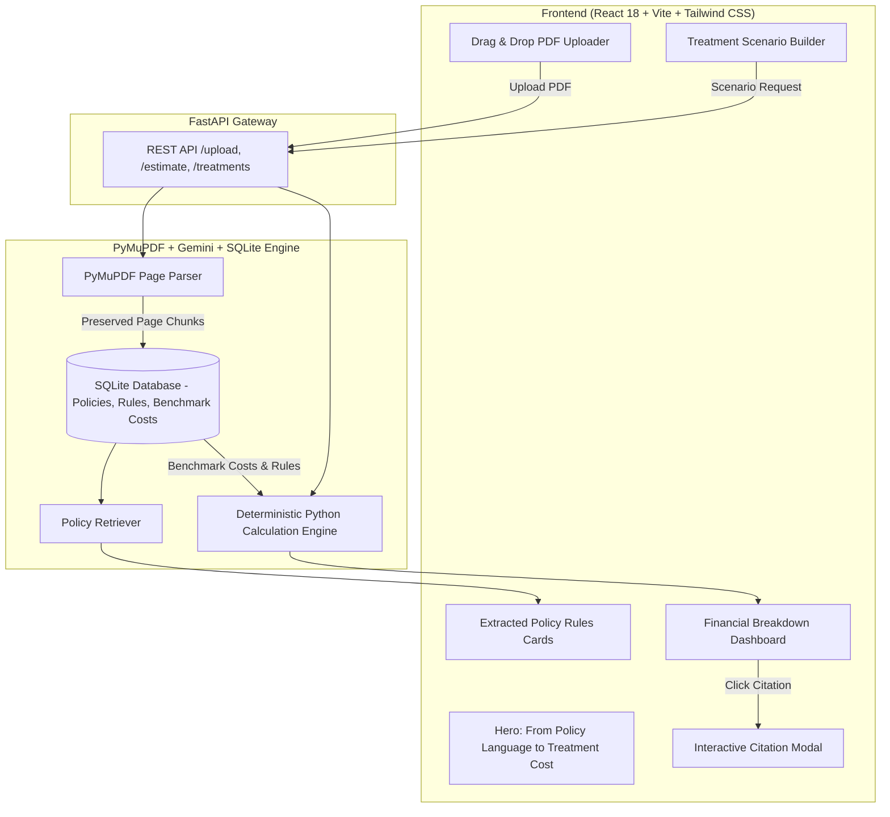

# Spasth — Insurance Policy Intelligence & Treatment Cost Estimator

[](https://github.com/your-org/spasth)
[](https://fastapi.tiangolo.com/)
[](https://react.dev/)
[](https://ai.google.dev/)
[](LICENSE)

> **Predict out-of-pocket medical expenses by fusing health insurance policy documents with localized treatment cost datasets using LLM intelligence and deterministic calculation logic.**

---

## 🔗 Local Access URLs

* **Frontend Dashboard UI**: [http://localhost:5173/](http://localhost:5173/)
* **Backend REST API Docs (Swagger)**: [http://127.0.0.1:8000/docs](http://127.0.0.1:8000/docs)
* **Backend Health Check**: [http://127.0.0.1:8000/api/health](http://127.0.0.1:8000/api/health)

---

## 📌 Headline & Core Value Proposition

> *"From Policy Language to Treatment Cost"*

**FIN-01** bridges the gap between complex insurance legal policy language and patient out-of-pocket financial reality:

1. **Upload Policy**: PyMuPDF page-preserving document extraction.
2. **Analyze Coverage**: Gemini RAG structured rule parsing (Sum Insured, Co-pay, Room Caps, Sub-limits).
3. **Estimate Cost**: Deterministic Python calculation engine providing evidence-grounded out-of-pocket range estimates.

---

## 🎬 60–90 Second Video Demonstration Script

Follow this sequence for the hackathon registration video:

1. **Upload Policy PDF**: Upload `sample_health_policy.pdf`. Observe automatic page extraction (3 pages preserved).
2. **Review Extracted Rules**: Inspect structured parameter cards (**Sum Insured: ₹5,00,000**, **Co-Pay: 10%**, **Room Rent Limit: ₹5,000/day**).
3. **Select Treatment Scenario**: Choose procedure (*Appendectomy*), city (*Pune*), room (*Standard Room*).
4. **Calculate Out-of-Pocket Liability**: Click **Calculate Out-of-Pocket Liability** to view:
   - Estimated Treatment Cost: **₹75,000 – ₹95,000**
   - Estimated Insurance Coverage: **₹67,500 – ₹85,500**
   - Estimated Out-of-Pocket: **₹7,500 – ₹9,500** (Visually Dominant)
5. **Inspect Citation**: Click on the **Mandatory Co-Payment** citation card to open the **Policy Evidence Citation Modal** showing exact text from Page 2, Clause 2.1.
6. **Scenario Sensitivity Recalculation**: Switch Room Category from **Standard** to **Deluxe**. Observe live recalculation applying the **30% Room Rent Proportionate Deduction Penalty**.
7. **Verify Confidence & Demo Label**: Observe **HIGH / MEDIUM Confidence Badges** and the disclaimer label (*"Illustrative demo cost data — not a hospital quotation"*).

---

## 📐 System Architecture



---

## 🛠️ Technology Stack

| Component | Technology | Responsibility |
| :--- | :--- | :--- |
| **Frontend UI** | React 18, Vite | Interactive dashboard, scenario controls, and glassmorphism styling |
| **Styling** | Tailwind CSS, Lucide Icons | Responsive fintech/healthtech design system |
| **Backend API** | Python 3.11, FastAPI | High-performance REST microservice |
| **PDF Processing**| PyMuPDF (`pymupdf`) | Page-preserving text extraction and structural indexing |
| **AI Extraction** | Gemini API | Structured policy rule parsing (Sum Insured, Co-pay, Room Caps) |
| **Database** | SQLite3 | Local storage for policies, page indices, rules, and cost benchmarks |
| **Rule Engine** | Python Core Logic | Deterministic financial calculation (Sub-limits, Co-pays, Room penalties) |
| **Testing** | Pytest | Automated verification of financial engine and API routes |

---

## 🧪 Automated Testing

```bash
# Run pytest verification suite
pytest backend/tests/
```

### Verified Test Cases:
* `test_cost_lookup_and_copay_calculation`: PASSED (Base cost lookup and 10% co-payment deductions).
* `test_procedure_sub_limit_calculation`: PASSED (Capping of claims exceeding procedure sub-limits).
* `test_room_rent_proportionate_deduction`: PASSED (30% proportionate deduction penalty on Deluxe rooms).
* `test_citation_preservation`: PASSED (Page number and clause string preservation).

---

## 💻 Local Setup & Execution

### 1. Backend Setup
```bash
cd backend
pip install -r requirements.txt
python -m uvicorn app.main:app --reload --port 8000
```

### 2. Frontend Setup
```bash
cd frontend
npm install
npm run dev
```

---

<p center="align">
  <i>FIN-01 • From Policy Language to Treatment Cost</i>
</p>
